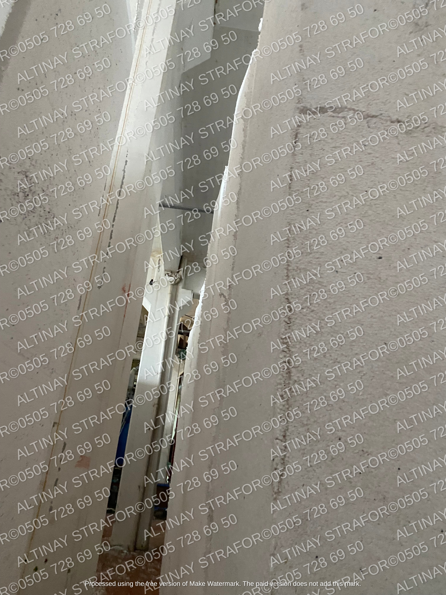
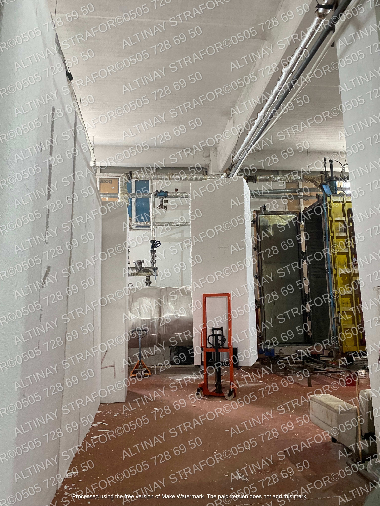

---
title: "Asmolen Nedir?"
date: 2023-04-30
description: "Asmolin Döşeme Nasıl Özelliklere Sahiptir?"
summary: "Asmolin tavan inşasında kullanılır. Tavanın düz görünmesini sağlamak amacıyla yapılan döşeminin arasına konur. Peki, bir binanın tavan inşası neden önemlidir? Neden bunun için özel malzemeler üretilir?"
etiketler: ["asmolen","asmolen nedir"]
---
**Asmolen Köpük**

İnşaat sektöründe sıklıkla kullanılan **asmolen köpük** malzemesine değinmeden önce, bu malzemenin kullanıldığı alanı inceleyelim.

**Asmolin** tavan inşasında kullanılır. Tavanın düz görünmesini sağlamak amacıyla yapılan döşeminin arasına konur. Peki, bir binanın tavan inşası neden önemlidir? Neden bunun için özel malzemeler üretilir?

Bir binanın tavanının sağlam ve dayanıklı olması, o binanın da sağlam ve dayanıklı olması anlamına gelir. Çünkü tavanlar binanın diğer bölümlerini destekler. Tavanların doğru şekilde inşa edilememesi, üst katların da düzgün bir şekilde desteklenmemesi demektir. Hatta bu durum, yükseklik farklarına da neden olabilir.

Tavanlar, binanın üstündeki hava koşullarından korunmayı sağlar. Âdeta bir bariyer görevi görür. Eğer tavan doğru inşa edilmezse su sızıntılarına yol açabilir. Binanın hasar görmesi kaçınılmaz olur. Ayrıca tavanlar yangın güvenliği için de son derece önemlidir. Alevlerin yayılmasını önleyen bir koruyucu görev görür. İnşada kullanılan malzemeye göre aynı zamanda ısı kontrolünü de sağlar. Böylece tavanlar hiç fark etmediğimiz şekilde enerji tasarrufu sağlar. Binaya göre tavanın doğru şekilde inşa edilmesi aynı zamanda o dairenin veya mekânın daha ferah görünmesine etki eder. Saydığımız bu ve buna benzer özellikler doğrultusunda tavanın hem bu faydalarından yararlanmak hem de estetik açıdan güzel bir görünüme sahip olabilmek için tavan inşasında nelere dikkat edilmeli diye sormadan geçmek olmaz.

**Asmolin Nedir?**

İnşaatta tavan yapımı, yukarıda saydığımız etkenler sebebiyle binanın tamamlanmasında önemli bir adımdır. Başta ısı kaybını en aza indirdiği için ısıtma ve soğutma maliyetlerini düşürücü bir yanı vardır. Ayrıca iyi bir tavan ses ne kadar yüksek olursa olsun o yüksek sesleri emer ve binanın içindeki gürültüyü en düşük seviyeye çeker. Bilhassa oturduğunuz konutta, tatil için gittiğiniz otelde ve her gün iş için bulunduğunuz ofisteki insan yoğunluğunu düşünün. Bu ses emme özelliğinin ne kadar önemli olduğunu düşünürken bile anlarız. İşte bu yararları ve aynı zamanda estetiği açısından tavanın inşası ve bu inşada kullanılan malzemeler önem kazanır.

İnşaat sırasında tavan yapılırken tavanın düz bir görüntüye bürünmesi için bir döşeme yapılır. Bu döşemenin ara kısımlarına dolgu malzemesi kullanılır. İşte kullanılan bu dolgu malzemesine **asmolin** denir. Bu döşemede kullanılan malzemeler ve döşemenin yapı tasarımı yukarıda saydığımız bütün unsurları etkilemektedir. O sebeple kullanılan malzemelerin kalitesi ve kullanım tarzı mühimdir.

**Neden Asmolin Kullanılır?**

**Asmolin** tavan döşemesi sırasında döşemede kullanılan demirlerin boşluklarını doldurmak amacıyla kullanılır. Bu ne sağlar?

- Tavan düz bir görüntüye kavuşur.
- Ses yalıtımı sağlanır.
- Isı yalıtımı için faydalıdır.

**Asmolin Döşeme Nedir?**

**Asmolin** döşemenin diğer bir adı da nervürlü yani dişli döşemedir. Dişli döşeme denmesinin sebebi, döşemede bulunan dişlerdeki araya dolgu malzemesi kullanılır. Bu sebeple de bu yapıya **asmolin** döşeme denir. Bu terimler, asmolen döşeme plakalarının alt kısmındaki şekillerin farklılıklarına göre kullanılır.

Nervürlü asmolen döşemelerin alt yüzeyinde, üzerinde yüklendiği kirişlere daha fazla yapışmasını sağlayan ince yükseklikte çıkıntılar vardır. Bu çıkıntılar, döşeme plakalarının daha yüksek mukavemet sağlamasına yardımcı olur. Nervürlü asmolen döşemeler, daha yüksek yük taşıma kapasitesine sahiptir ve daha uzun açıklıklar için uygundur.

Dişli **asmolin** döşemelerin alt yüzeyinde, yüklendiği kirişlere yerleştirilmiş diş benzeri bir şekil vardır. Bu dişler, asmolen döşemenin kirişlerle daha iyi bir şekilde bağlanmasını sağlar ve böylece daha iyi bir yapısal bütünlük elde edilir.

**Asmolin Döşeme Nasıl Özelliklere Sahiptir?**

**Asmolin** döşeme, iki kiriş arasındaki açıklığı kapatmak için kullanılır ve bu açıklığı tamamen doldurarak düzgün ve güçlü bir zemin oluşturur.

**Asmolin** döşemenin sahip olduğu özellikler, onun inşaatta daha fazla tercih edilmesini sağlamaktadır:

- Bu döşemeyi yapmak kolaydır.
- Boşluk oluşturmak rahattır.
- Tavanın güzel gözükmesini sağlar.
- Isı yalıtımı için kullanışlıdır.
- Ses yalıtımına katkı sağlar.
- Bu döşemenin gideri daha azdır.
- İşçilik daha azdır.
- Girintisi çıkıntısı yoktur.

**Neden Asmolin Döşeme Tercih Edilir?**

İnşaatlarda sıklıkla **asmolin** döşeme tercih edilir. Yukarıda saydığımız özellikler, aslında bu döşemenin neden çokça kullanıldığını göstermektedir. Bu tercih ögelerinin yanında birkaç tane daha artı özellik sıralayabiliriz.

**Asmolin** döşeme üzerinde duvar yükü daha rahat taşınır. Ayrıca projenin çiziminde hesaplama da daha kolay yapılır. Döşemenin ağır yük taşımasını mümkün kılar. Üstelik toz da tutmaz. Bu da yapının verimliliği ve işlevselliği için önemli bir özelliktir. Sağlam bir yapı olduğu için gerek dayanıklılık gerekse iklim şartlarına olan uyumu hâlâ yaygın olarak kullanımını destekler.

**Asmolen Köpük Nedir?**

Döşemede tavanın görüntüsündeki kusursuzluk tasarımı ve yapısısayesindedir demiştik. Paralel olarak oluşturulan blokların içine döşenen malzeme de çeşit çeşittir. Bu malzemelerden günümüzde kullanım avantajlarıyla **asmolen köpük** dikkatleri üzerine çekmeyi başarır. Yani bu malzeme, bir döşeme çeşididir.

**Asmolen Köpük Nerede Kullanılır?**

Mimarlık ve inşaat sektöründe **asmolen köpük** tavan döşemesinde döşemenin iç kısımlarını doldurmak için kullanılır. Aynı zamanda yalıtım malzemesi olduğu için yalıtımda da sıkça tercih edilir.

**Asmolen Köpük Kullanmak Avantajlı Mı?**

Bu döşemede **asmolen köpük** kullanmanın pek çok avantajı vardır. Bunlardan bazılarını şöyle sıralayabiliriz:

- **Asmolen köpük** hafif bir malzemedir.
- Diğer malzeme çeşitlerine göre daha kolay bir şekilde kullanılır.

- Pratiktir.
- Uygulama yaparken de avantajlıdır.
- İyi bir verim sağlar.
- Kolayca kesilir. Bu sayede beton fazlalığı olmaz.
- Hafif olduğu için taşınması da kolaydır.
- Isı yalıtımı sağlar.
- Kolay döşenir.
- İşçiliği kolaydır.
- **Asmolen köpük** yapısı sayesinde suyu çeker. Bu da betonun çatlamasına engel olur. Diğer çeşitlerde sulama yapıldığı için betondaki mukavemet düşüyordu.
- Bu malzemenin maliyeti daha düşüktür. Nakliyede herhangi bir zarar görülmez.
- Döşeme içine bu köpük yerleştirilirken altına file döşenir. Bu da sıvanın tutmasını sağlar. Bu konuda da sıkıntı yaşanmaz. Üzerine uygun sıvı yapıldığında malzeme açısından herhangi bir dezavantaj söz konusu olmayacaktır.
- Yangına dayanıklı hale gelmesi için yönetmeliğe uygun şekilde en az 2 cm sıva yapılmalıdır.

**Asmolen Köpük Kullanmanın Dezavantajı Var Mı?**

**Asmolen köpük** malzemesinin tavan döşemesi için tek bir dezavantajı söz konusudur. O da malzemenin yangına karşı dayanaksız oluşudur. Fakat yönetmelikte getirilen kurala göre kaliteli üretilmiş bir köpük kullanıldığında ve köpüğün olduğu kısma yangın için dayanıklı bir sıva sürüldüğünde sorun kalmaz.

**Asmolen Köpük Özellikleri Nelerdir?**

- **Asmolen köpük** ısı yatılımı için kullanılacaksa 15-30 kg/m3 yoğunlukta üretilir. Çünkü bu malzemenin kullanılacağı alana göre yoğunluğu da farklılaşmaktadır.
- Kapalı gözeneklidir. Bu sebeple de ne suda çözülür ne de erir. Yani su geçirmezdir.
- Soğuk alanlarda kullanım için ideal yapıdadır. Çünkü 100 C° ye kadar dayanıklı bir yapısı vardır. Sıcağa dayanma süresi sıcağın ölçüsüne bağlı olarak değişir.
- Kullanılacağı yerin durumuna göre uygun bir yoğunluk seçilip uygulanırsa malzeme bozulmadan yıllarca durur.

**Asmolen Köpük Üretiminde Dikkat Edilecek Unsurlar Neler?**

Yukarıda saydığımız özelliklere sahip dayanıklı ve sağlam bir tavan için kullanılan malzemenin de kaliteli olması gerekir. **Asmelon köpük** , poliüretan malzemeden yapılır. Bu malzeme, sıcaklık ve ses yalıtımı sağlamak için birebirdir. Suya dayanıklı yapısı sayesinde böcek ve kemirgen gibi haşeratların girmesini de engeller. Bu kaliteli özellikler için bu malzemenin üretimi sırasında dikkat edilecek ögelerden bazıları şöyledir:

- **Asmelon köpük** malzemesinin kaliteli bir şekilde üretilmesi, yapımında kullanılan maddelerin doğru miktarda ve doğru şekilde karıştırılmasına bağlıdır. Çünkü doğru oran mukavemet için önemlidir.
- Köpük malzemenin doğru sıcaklık aralığında tutulması için ısı kontrolünün yapılması gerekir. Bu sebeple de özel kaplarda üretilir.
- Nem kontrolü de önemlidir. Nem içeriği malzeme kalitesini etkiler. Köpük malzemenin üretimi sırasında nemi düşük seviyelerde tutulmalıdır.
- Kalıpların şekli ve boyutu da ihtiyaca göre olmalıdır.

**Asmolen Köpük Kalitesiz Üretilirse Ne Olur?**

**Asmolen köpük** üretiminde görülen kalitesizlik pek çok soruna neden olabilir:

- Çatlamalar görülebilir.
- Yapının ömrü kısa olur.
- İnşa süreci ve sonrasında maliyet artar.
- Çökmeye ve yıkılmaya yatkınlık görülebilir.
- Binadaki konfor etkilenir.
- Enerji verimliliğinde sıkıntılar görülür.
- Sıcaklık ve nem kontrolü yetersiz kalabilir.

**Asmolen Köpük Nerede Üretilir?**

Yıllardır inşaat sektörü için malzeme üreten firmamız, **asmolen köpük** üretimi ve satışı ile müşterilerinin taleplerine cevap vermektedir. Firmamız, farklı ölçü ve kalınlıklarda asmolen üretir. Müşterilerimiz ihtiyaçlarına göre seçim yapabilirler.

Dayanıklı ve kullanışlı olması sebebiyle müşteriler için vazgeçilmez bir inşaat malzemesi haline gelen **asmolen köpük** fabrikamızda üretilerek müteahhitler, inşaatçılar ve bu malzemeye gereksinim duyan bütün müşterilerimiz için satıştadır.

Silivri'de yer alan firmamız Tekirdağ, Çorlu, İstanbul olmak üzere Türkiye'nin birçok şehrine malzeme satışı bulunmaktadır. Bu alanda yıllardır üretim yapan bir firma olarak amacımız malzemelerimizi en iyi kalitede müşterilerimize sunabilmektir.

Hizmet anlayışımızın temelinde müşterilerimize sunduğumuz ürünlerin kalitesi yatmaktadır. Bu sebeple de müşterilerimizin memnuniyetini ilk sırada tutarak **asmelon köpük** taleplerini karşılıyoruz.

Bir firma için önemli ögelerden biri güvenilir olmaktır. Biz de her zaman en iyi hizmeti sunmayı hedeflediğimiz için **70x70x23** boyutlarında özel olarak üretilmiş bu köpük malzemeyi bulundurarak taleplere cevap veriyoruz. Bu kapsamlı hizmetimizi aynı zamanda müşterilerimiz sipariş verdiği andan itibaren süratle karşılıyoruz.

**Asmolen Köpük Fiyatları Uygun Mu?**

Firmamızda **70x70x23** ölçülerde köpük malzeme olduğu gibi farklı ölçülerde de bulunmaktadır. Stoklarımızda yeterince ürün bulunduğu için sipariş verildiğinde müşterilerimize hızlıca dönüş yapabiliyoruz. Bu alanda verdiği hizmetlere, çıkardığı ürünlere dikkat ederek güvenilir bir firma olmayı başarmanın motivasyonu ile personelimiz her zaman daha iyisi için çalışıyor.

Ekip arkadaşlarımız ve ustalarımız alanında en iyi hizmeti verebilecek kişilerden oluşmaktadır. Üretimden satışa geniş bir çalışma ağına sahip olan firmamız, öncelikli olarak çalışanlarında ekip ruhunu gözetmektedir.

**Asmolen köpük** başta olmak üzere inşaat sektöründe gelişmekte olan il ve ilçeler için en uygun fiyat teklifini vererek kârlı bir alışveriş imkânını sunar. M3 olarak fiyatları makul bir seviyede tutuyoruz. Amacımız müşterilerimizin kaliteyi uyguna mal edebilmesini sağlamaktır.

**Asmolen Köpük Hizmeti Verdiğimiz Bölgeler Neresi?**

Satış yaptığımız bölgeler şöyledir:

- Edirne
- Kırklareli
- Tekirdağ
- İstanbul

Bütçenizi de zorlamadan güvenilir bir firmadan kaliteli bir ürünü uyguna almak isterseniz, firmamızı arayabilir veya Whatsapp üzerinden mesaj atarak bizimle iletişime geçebilirsiniz.

Firmamız ürettiği malzemelerin kalitesinden emin olduğu için verdiği hizmette oldukça iddialıdır. Son gelişmeleri takip ederek en yeni teknolojileri de kullanarak hizmet ağını her geçen gün genişletmektedir. Hizmet verdiği illerin pek çok ilçesinde merkezi bulunur. Bu merkezler sayesinde hızlı bir şekilde siparişlerinize ulaşabilirsiniz. Toptan satışımız mevcuttur. Özellikle **70x70x23** boyutlarında asmolen almak isterseniz toptan sipariş verebilirsiniz.

Hizmet verdiğimiz ilçelere her gün bir yenisi eklense de şu anki ilçeleri şöyle sıralayabiliriz:

- Avcılar
- Arnavutköy
- Bağcılar
- Bahçelievler
- Bakırköy
- Başakşehir
- Bayrampaşa
- Beylikdüzü
- Büyükçekmece
- Esenyurt
- Esenler
- Eyüp
- Fatih
- Gaziosmanpaşa
- Kâğıthane
- Küçükçekmece
- Sarıyer
- Silivri
- Şişli
- Zeytinburnu
- Tekirdağ
- Çerkezköy
- Çorlu
- Kapaklı
- Malkara
- Marmara Ereğlisi.
